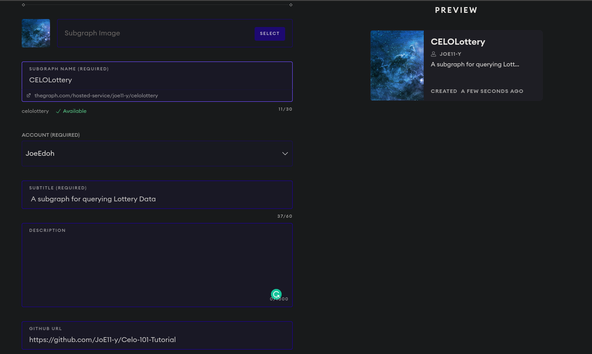
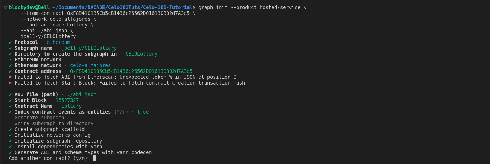
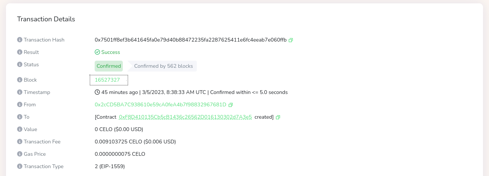
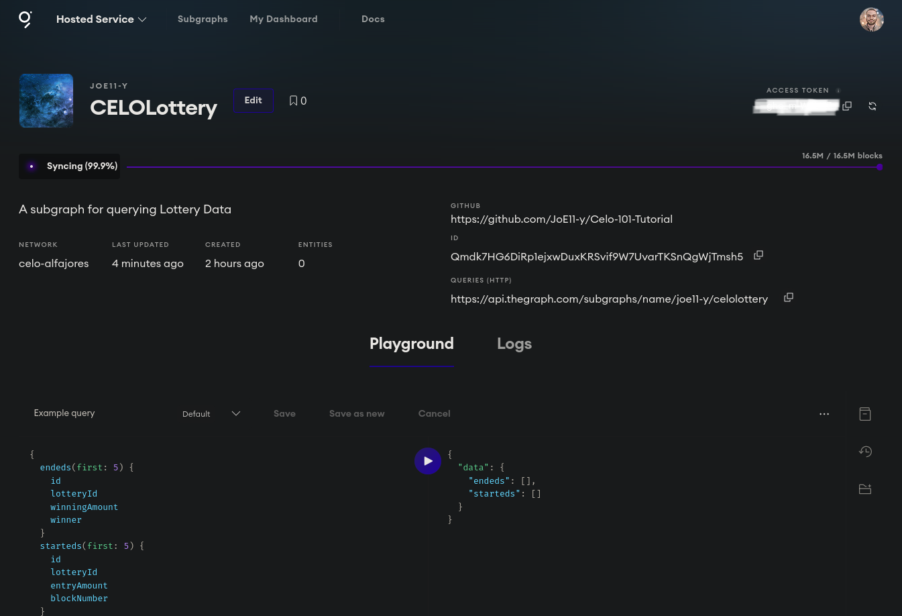

# USING THE GRAPH TO INDEX TRANSACTIONS

## Introduction

For most apps built on blockchains like Ethereum and other EVM based chains, it's hard and time-intensive to read data directly from the chain, so you used to see people and companies building their own centralized indexing server and serving API requests from these servers. This requires a lot of engineering and hardware resources and breaks the security properties required for decentralization.

This tutorial will focus on us building an API on top of blockchain data that can easily be deployed to a decentralized web infrastructure. The protocol we'll be working with is called the Graph

The Graph is an indexing protocol for querying blockchains like Ethereum and networks like IPFS. Anyone can build and publish open APIs, called subgraphs, making data easily accessible.

Subgraphs are made up of a few main parts:

1. GraphQL Schema: This defines the data types / entities you would like to save and query for. You can also define configuration like relationships and full text search capabilities in your schema.

2. Subgraph Manifest (yaml configuration): (from the docs) The manifest defines the smart contracts your subgraph indexes, their ABIs, which events from these contracts to pay attention to, and how to map event data to entities that Graph Node stores and allows to query.

3. AssemblyScript Mappings: This allows you to save data to be indexed using the entity types defined in your schema. The Graph CLI also generates AssemblyScript types using a combination of the subgraph's schema along with a smart contract's ABIs.

## Prerequisites

- Basics of programming with JavaScript and Typescript.
- Basic knowledge of programming with Solidity
- Basic knowledge of how to use the remix ide
- Basic knowledge of using the command line

## Requirements

- Have node installed from version V10. or higher
- NPM or Yarn Installed.

## Tutorial

### STEP 1: Creating the Subgraph

There are two ways to create a new subgraph. We can either choose to make it from an example subgraph, or from an existing smart contract.

In this tutorial we'll be creating a subgraph from an existing smart contract. The smart contract we'll use is the Lottery smart contract gotten from another tutorial on this platform [Kishore Tutorial Lottery SmartContract](https://dacade.org/communities/celo/courses/celo-tut-101/challenges/2f141e8b-104a-4b29-9a23-44f424b52695/submissions/cd82d935-1b47-4381-9133-60cb0d379fb1). More information about the contract is on the submission page, so if you're feeling out of depth you can choose to pause here and go over Kishore's Tutorial.

```solidity
// SPDX-License-Identifier: MIT
pragma solidity ^0.8.0;

// import "witnet-solidity-bridge/contracts/interfaces/IWitnetRandomness.sol";

//if compiling on remix
import "https://github.com/witnet/witnet-solidity-bridge/contracts/interfaces/IWitnetRandomness.sol";


contract Lottery {
    //Address of the witnet randomness contract in Celo Alfajores testnet
    address witnetAddress = 0xbD804467270bCD832b4948242453CA66972860F5;
    IWitnetRandomness public witnet = IWitnetRandomness(witnetAddress);

    // The price to enter the lottery
    uint256 public entryAmount;

    uint256 public lastWinnerAmount;
    uint256 public lotteryId;
    uint256 public latestRandomizingBlock;

    address payable public lastWinner;
    address[] public players;
    address public owner;

    bool public open;

    constructor() {
        owner = msg.sender;
    }

    modifier onlyOwner() {
        require(msg.sender == owner, "not owner");
        _;
    }

    //Checks if there is a current active lottery
    modifier onlyIfOpen() {
        require(open, "Not Open");
        _;
    }

    event Started(uint lotteryId, uint entryAmount);
    event Ended(uint lotteryId, uint winningAmount, address winner);

    error reEntry();

    function start(uint32 _entryAmount) external onlyOwner {
        //Check if there is a current active lottery
        require(!open, "running");

        // Convert the default wei input to celo
        entryAmount = _entryAmount * 1 ether;

        open = true;

        // Deleting the previous arrays of players
        delete players;

        emit Started(lotteryId, _entryAmount);
        lotteryId++;
    }

    function join() external payable onlyIfOpen {
        require(msg.value == entryAmount, "Insufficient Funds");

        //Check if user is already a player
        for (uint i = 0; i < players.length; i++) {
            if (msg.sender == players[i]) {
                revert reEntry();
            }
        }
        players.push(msg.sender);
    }

    function requestRandomness() external onlyOwner onlyIfOpen {
        latestRandomizingBlock = block.number;

        //Setting the fee to 1 celo
        uint feeValue = 1 ether;
        witnet.randomize{value: feeValue}();
    }

    function pickWinner() external onlyOwner onlyIfOpen {
        // Check if the requestRandomness was called to generate the randomness
        assert(latestRandomizingBlock > 0);

        uint32 range = uint32(players.length);
        uint winnerIndex = witnet.random(range, 0, latestRandomizingBlock);

        lastWinner = payable(players[winnerIndex]);
        lastWinnerAmount = address(this).balance;

        (bool sent, ) = lastWinner.call{value: lastWinnerAmount}("");
        require(sent, "Failed to send reward");

        open = false;
        latestRandomizingBlock = 0;
        emit Ended(lotteryId, lastWinnerAmount, lastWinner);
    }

    receive() external payable {}
}
```

To get started, go to [The Graph's Hosted Service](https://thegraph.com/hosted-service) and Login using your GitHub account and visit My Dashboard tab.

Next, go to the dashboard and click on Add Subgraph to create a new subgraph.


:placard: Take note of your Access Token

Configure your subgraph with the following properties:

```text
    Subgraph Name - celolottery
    Subtitle - A subgraph for querying Lottery Data
    Optional - Fill the description and GITHUB URL properties
```



Once the subgraph is created, we will initialize the subgraph locally using the Graph CLI.

### STEP 2: Initializing And Deploying the Subgraph

To set up the Graph CLI create a new folder `Lottery` from the terminal.

Next, inside this folder install the Graph CLI:

```bash
$ npm install -g @graphprotocol/graph-cli

# or

$ yarn global add @graphprotocol/graph-cli
```

Once the Graph CLI is installed, create an abi.json file (this is needed to initialize the graph), compile the contract on [remix](https://remix.ethereum.org/#optimize=false&runs=200&evmVersion=null&version=soljson-v0.8.7+commit.e28d00a7.js&lang=en) and copy the abi into this file. An already compiled version of the contract can be found [here](""), you can also copy from there.

A deployed version of this contract exists @ [0xF8D410135Cb5cB1436c26562D016130302d7A3e5](https://explorer.celo.org/alfajores/address/0xF8D410135Cb5cB1436c26562D016130302d7A3e5/transactions#address-tabs)

Now on the terminal execute this command to initialize the subgraph

```bash
$ graph init --product hosted-service \
    --from-contract 0xF8D410135Cb5cB1436c26562D016130302d7A3e5 \
    --network celo-alfajores \
    --contract-name Lottery \
    --abi ./abi.json \
    joe11-y/celolottery
```

The CLI tool will prompt you for some additional information. Just enter as is using the preset values for the arguments. Now for the subgraph name, enter your GitHub username followed by the name of your project. In my case this is joe11-y/CELOLottery.



Now chances the CLI fails to fetch the ABI and the start Block of the Contract are high, so you may have to respecify when queried about the `ABI file (path)` and the block number. The ABI file path is already known in this case as `./abi.json`, while the start blocknumber can be gotten from the [celo explorer](https://explorer.celo.org/alfajores/tx/0x7501ff8ef3b641645fa0e79d40b88472235fa2287625411e6fc4eeab7e060ffb) for the contract creation.



The tool sets up the subgraph in the specified directory `celolottery`.

Next is to authenticate the subgraph with the access token, so head over to the dashboard and copy the access token, then run this command on your terminal.

```bash
graph auth --product hosted-service <ACCESS_TOKEN>
```


Now go into the directory which was generated by the CLI tool and run the command

```bash
yarn deploy 
# or 
npm run deploy
```


Now you can go back to your dashboard and you'll be able to see that your subgraph has been deployed. You will also see that the graph has set example queries using the events in the contract and there's a button there that allows you to test out those queries.



### STEP 3: Creating new queries
